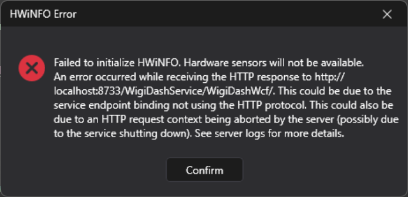

# WigiDash / HWiNFO Initialization Failure - Root Cause and Resolution

WigiDash is a hardware monitoring tool that integrates with HWiNFO to display system sensors. This document addresses a common initialization failure that occurs after Windows updates.

## Quick Fix

```powershell
Enable-WindowsOptionalFeature -Online -FeatureName WCF-HTTP-Activation45,WCF-HTTP-Activation -All
```

Then reboot and relaunch WigiDashManager.

## Incident Summary

**Symptom:**
WigiDash Manager failed to initialize HWiNFO sensors, displaying the error:

> Failed to initialize HWiNFO. Hardware sensors will not be available.
> An error occurred while receiving the HTTP response to [http://localhost:8733/WigiDashService/WigiDashWcf/](http://localhost:8733/WigiDashService/WigiDashWcf/). This could be due to the service endpoint binding not using the HTTP protocol. This could also be due to an HTTP request context being aborted by the server (possibly due to the service shutting down).



**Observed Behavior:**

* The internal WCF endpoint (`localhost:8733/WigiDashService/WigiDashWcf/`) was unreachable.
* `Invoke-WebRequest` failed with *"connection forcibly closed"*.
* `WigiDashService.exe` did not bind to port 8733 (no listener in `netstat`).
* No missing or quarantined HWiNFO libraries.
* `WigiDashManager.exe` terminated due to an unhandled `System.ServiceModel.CommunicationException`.

---

## Root Cause

Windows cumulative updates disabled the **Windows Communication Foundation (WCF) HTTP Activation** components.
Without these, the .NET 4.8.1 WCF runtime cannot host HTTP endpoints used by `basicHttpBinding` services.

As a result:

* `WigiDashService` failed to open its HTTP listener on `localhost:8733`.
* The client proxy in `WigiDashManager` received a forced connection closure.
* Initialization of HWiNFO sensors failed since communication never started.

---

## Corrective Actions

### 1. Verify WCF Components

```powershell
Get-WindowsOptionalFeature -Online -FeatureName *WCF*
```

Expected problem state:

```powershell
WCF-HTTP-Activation45 : Disabled
WCF-HTTP-Activation   : Disabled
```

### 2. Re-enable Required Components

```powershell
Enable-WindowsOptionalFeature -Online -FeatureName WCF-HTTP-Activation45,WCF-HTTP-Activation -All
```

### 3. Reboot the System

Reboot is required to register HTTP.sys listeners and reload the WCF service model.

### 4. Validation Steps

After reboot:

```powershell
netstat -ano | findstr :8733
# Expect to see LISTENING on localhost:8733

Invoke-WebRequest http://localhost:8733/WigiDashService/WigiDashWcf/ -UseBasicParsing
# Expect XML/WSDL output, not a socket error
```

Once these checks pass, relaunch **WigiDashManager**. The HWiNFO initialization completes normally and hardware sensors populate as expected.

---

## Technical Explanation

WigiDash embeds a **self-hosted WCF service** that exposes local hardware telemetry through HTTP (`basicHttpBinding`). The configuration specifies:

```xml
<binding name="BasicHttpBinding_IWigiDashWcf" />
<baseAddress>http://localhost:8733/WigiDashService/WigiDashWcf/</baseAddress>
```

If `WCF-HTTP-Activation` is disabled, .NET cannot register HTTP channels with `HTTP.sys`. The call to `ServiceHost.Open()` fails, producing a `SocketException` that surfaces as “connection forcibly closed.”

This failure prevents the WigiDashManager client from connecting to the internal API, which in turn causes the HWiNFO subsystem to report initialization failure.

---

## Post-Fix Verification

| Check                   | Expected Result  |                     |
| ----------------------- | ---------------- | ------------------- |
| `WCF-HTTP-Activation45` | Enabled          |                     |
| `WCF-HTTP-Activation`   | Enabled          |                     |
| `netstat -ano           | findstr :8733`   | Port 8733 LISTENING |
| `Invoke-WebRequest`     | Returns WSDL XML |                     |
| WigiDashManager Launch  | No HWiNFO error  |                     |

---

## Preventive Actions

1. After future Windows cumulative updates, verify WCF feature state:

   ```powershell
   Get-WindowsOptionalFeature -Online -FeatureName *WCF* | Where-Object {$_.State -eq 'Disabled'}
   ```

2. Add a startup check or scheduled task to ensure these remain enabled:

   ```powershell
   Enable-WindowsOptionalFeature -Online -FeatureName WCF-HTTP-Activation45,WCF-HTTP-Activation -All -NoRestart
   ```

---

## Summary

**Root Cause:** Disabled WCF HTTP Activation components after a Windows update.
**Fix:** Re-enable `WCF-HTTP-Activation45` and `WCF-HTTP-Activation` features, then reboot.
**Result:** `localhost:8733/WigiDashService/WigiDashWcf/` becomes accessible; WigiDashManager initializes normally with functional HWiNFO sensors.

---

## Confirmation

.png)

---

## Additional Context

Further investigation shows that the issue is linked to Windows Update KB5066133, associated with CVE-2025-55248. The update hardened the Windows Communication Foundation (WCF) HTTP Activation component in the .NET Framework, enforcing stricter registration and binding rules to reduce potential remote-code-execution and privilege-escalation risks.

As a result, applications that rely on basicHttpBinding over local HTTP endpoints - like WigiDashService - can no longer initialize correctly unless the WCF HTTP Activation feature is explicitly re-enabled or bundled into the application.

As someone who works in cybersecurity, I’m usually the last person to suggest lowering security settings. In this case, however, the affected service only exposes local system monitoring metrics, not externally accessible interfaces. Re-enabling HTTP Activation as a temporary workaround carries minimal risk until the vendor releases a properly patched build.

## UPDATE 

Looks like this underlying cause is more widespread.
https://www.techpowerup.com/341976/microsoft-breaks-localhost-with-windows-11-october-update-users-forced-to-revert

---

## Tags

`wigidash` `hwinfo` `wcf` `windows` `troubleshooting` `hardware-monitoring` `KB5066133`
